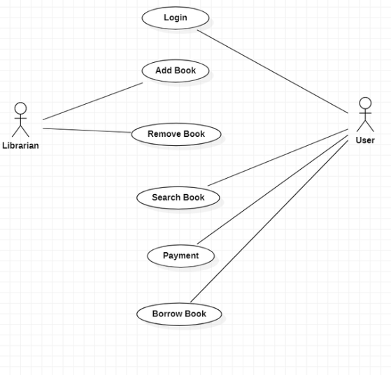

**High Level Design**

**Purpose**:

`	`Library management systems help libraries keep track of the books and their checkouts, as well as members’ subscriptions and profiles. Library management systems also involve maintaining the database for entering new books and recording books that have been borrowed with their respective due dates.

**Scope:**

`	`The library management system helps a librarian to maintain all types of books, journals, newspaper’s counts, and member information including profiles, penalties, payments, and other financial transactions. Library management software includes some operations such as filtering the data, sorting, finding information across the huge data field, and editing of data.

**Use Case Diagram**:

**Actors**:

- **Librarian:** Mainly responsible for adding and modifying books, book items, and users. The Librarian can also issue, reserve, and return book items.
- **User:** All members can search the catalog, as well as check-out, reserve, renew, and return a book.

**Use cases**:

- **Add Book**: Admin adds the book what user chooses.
- **Delete Book**: Admin deletes the book what he wants to delete.
- **Login**: It performs login operation.
- **Search Book**: Searches for the book.
- **Borrow Book**: Borrows the book
- **Payment**: pay for book what he chooses.

